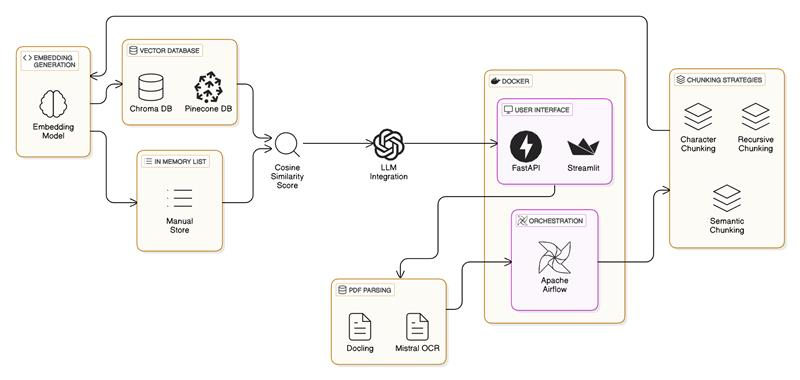

# 📘 Building a RAG Pipeline with Airflow

We are enhancing the **LLM Extractor Project** in this organization to implement **Retrieval-Augmented Generation (RAG)** concepts for reducing input tokens and improving efficiency.

---

## 📌 Overview

This project implements a Retrieval-Augmented Generation (RAG) pipeline using **Apache Airflow** for orchestrating data pipelines and **FastAPI + Streamlit** for interactive user interfaces.  
The goal is to build a scalable, modular system that extracts insights from **NVIDIA’s quarterly reports (past 5 years)** using various parsing and retrieval techniques.

---

## 🧠 Key Features

- **Data Source**: NVIDIA quarterly reports (last 5 years)

### 📄 PDF Parsing Options
- Assignment 1's Parser  
- [Docling](https://github.com/docling)  
- [Mistral OCR](https://mistral.ai/news/mistral-ocr)

### 🔍 RAG Pipeline Options
- Manual Embeddings + Cosine Similarity  
- Pinecone Integration  
- ChromaDB Integration  

### 📏 Chunking Strategies
- Fixed-size chunks  
- Semantic chunks  
- Sliding window chunks  

### 🧠 Hybrid Search
- Query by quarter to fetch context-specific information  

### 🖥️ Interactive UI (via Streamlit)
- Upload PDFs  
- Select parser, chunking strategy, and RAG method  
- Query quarter-specific data  

### 🚀 Deployment
- Dockerized **Airflow pipeline**  
- Dockerized **Streamlit + FastAPI interface**

---

## 🚀 Getting Started

### 🔧 Requirements
- Docker & Docker Compose  
- Python 3.9+  
- Conda (optional for local development)  
- NVIDIA reports downloaded into `/data/raw_reports`

---

## 📂 Project Structure
📦 Building-a-RAG-Pipeline-with-Airflow/
├── 📂 Airflow/
│   ├── 📂 dags/
│   ├── 📂 logs/
│   ├── 📂 config/
│   ├── 📂 plugins/
│   └── 📄 Dockerfile
├── 📂 Backend/
│   ├── 📄 __init__.py
│   ├── 📄 main.py
│   ├── 📄 api.py
│   ├── 📄 logger.py
│   ├── 📄 litellm_query_generator.py
│   ├── 📂 parsing_methods/
│   │   ├── 📄 __init__.py
│   │   ├── 📄 doclingparsing.py
│   │   ├── 📄 mistralparsing.py
│   │   └── 📄 mistralparsing_userpdf.py
│   └── 📄 Dockerfile
├── 📂 Rag_modelings/
│   ├── 📄 __init__.py
│   ├── 📄 chromadb_pipeline.py
│   ├── 📄 rag_pinecone.py
│   └── 📄 rag_manual.py
├── 📂 uploads/
├── 📂 user_markdowns/
├── 📂 chroma_db/
├── 📂 chunk_storage/
├── 📂 local_vector.db/
├── 📄 docker-compose.yml
├── 📄 pyproject.toml
├── 📄 poetry.lock
└── 📄 .env

